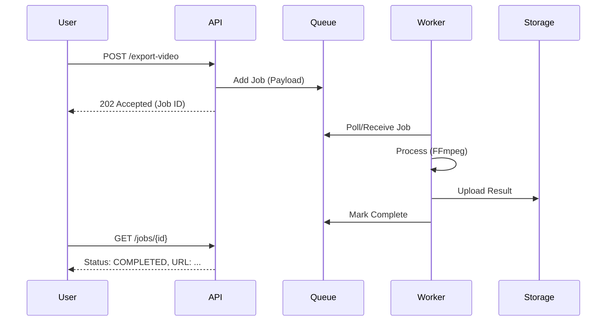

# Background Queue System

Heavy tasks like video rendering and batch image processing should not block the main API response. We use a background queue.

## Components

1.  **Producer**: API endpoints (`export-video`, `export-image`) that create a job entry.
2.  **Job Store**: `storage_jobs` table in Postgres to track state.
3.  **Broker/Queue**:
    - **Option A (Simple)**: Polling based on `storage_jobs` status.
    - **Option B (Recommended)**: Redis (BullMQ) or Supabase Edge Functions with a message broker like Upstash QStash.
4.  **Consumer (Worker)**: A dedicated Node.js process or serverless function that listens for jobs and executes FFmpeg/Fabric.js commands.

## Job Lifecycle

1.  `QUEUED`: User requests export. Entry added to `storage_jobs`.
2.  `PROCESSING`: Worker picks up the job, updates status, and starts FFmpeg.
3.  `COMPLETED`: Worker uploads the result, updates `result_url`, and marks as done.
4.  `FAILED`: Worker logs the error in the `error` column.

## Sequence Diagram

