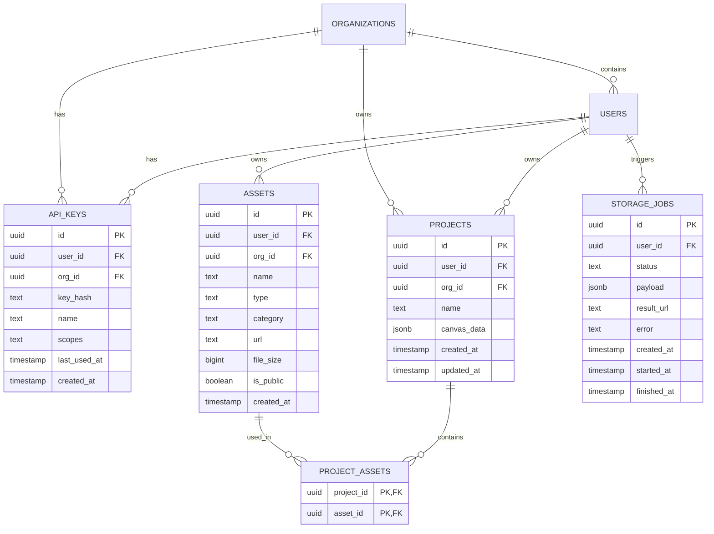

# Database Design (3rd Normal Form)

This document outlines the database schema for Pixigen, designed for scalability, multi-tenancy, and 3NF compliance.

## ER Diagram (Mermaid)

## Normalization (3NF) Analysis

1.  **1NF (First Normal Form)**:
    - All tables have a primary key (`id`).
    - Values are atomic (e.g., `canvas_data` is a single JSONB block, but could be further broken down if we filtered by elements; for now, it's the atomic state of a project).
2.  **2NF (Second Normal Form)**:
    - All non-key attributes are fully functional dependent on the primary key.
    - Moved many-to-many relationships (projects to assets) into a junction table `PROJECT_ASSETS`.
3.  **3NF (Third Normal Form)**:
    - No transitive dependencies.
    - `ORGANIZATIONS` handles multi-tenancy separately from `USERS`, avoiding duplication of org details in the user profile.

## Key Tables

- **`api_keys`**: Essential for selling the service. This allows programmatic access.
- **`storage_jobs`**: Supports the background queue system by tracking the lifecycle of media processing.
- **`project_assets`**: Decouples assets from projects, allowing the same asset (e.g., a logo) to be used across multiple projects without duplication.
