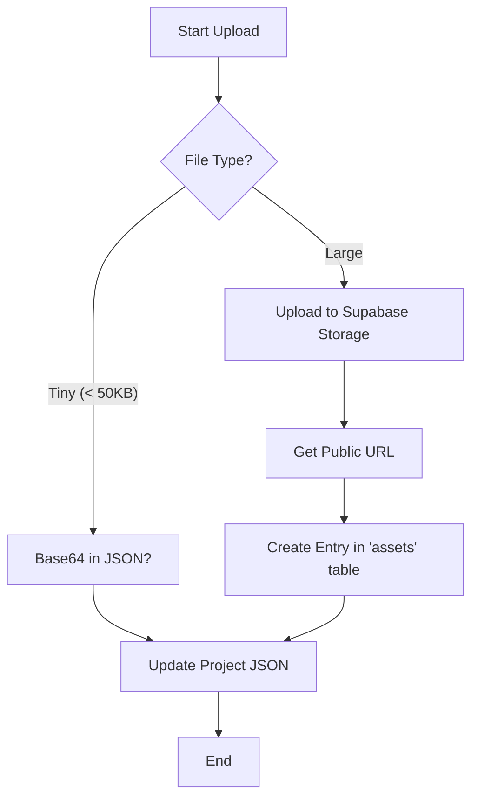

# Storage Algorithm

Pixigen handles diverse media (images, videos, logic JSON). This document describes the logic for selecting storage tiers and handling uploads.

## Storage Strategy

1.  **Project State**: Stored as JSONB in the `projects` table (Supabase/Postgres).
2.  **User Assets**: Stored in Supabase Bucket (`assets`).
3.  **Exported Media**: Stored in a dedicated `exports` bucket with a lifecycle policy (e.g., delete after 30 days).

## Algorithm Flow (Media Upload)

## Implementation Details

- **Deduplication**: Before uploading, calculate the MD5/SHA-1 hash of the file. If an asset with the same hash exists, reuse the existing URL to save storage.
- **Image Optimization**: On upload, generate thumbnails and optimized versions (WebP) using a background worker.
- **CORS Proxy**: External assets (provided via URL) are proxied via `api/proxy` to ensure canvas compatibility (no tainted canvas errors).
